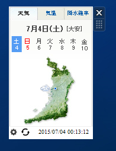

# WindowsGagdet
Windowsガジェットについてまとめる。

現在は重大な脆弱性により非推奨となっている。

http://windows.microsoft.com/ja-jp/windows/gadgets

## Weather_u
Windowsのデフォルトお天気ガジェットは上記非推奨化と同時に外部に接続できなくなり使えなくなった。
その代替とする。

ダウンロードはこちらから
https://github.com/urusupa/WindowsGagdet/blob/master/Weather_u.gadget?raw=true

**usage**
* 歯車マークでgadgetフォルダを開く
* 更新マークで最新の情報へ更新する
* 右下のタイムスタンプは最終更新時間  
* 表示地域の変更
  * sub.htmlの8行目を編集
  * http://www.tenki.jp/webservice/blogparts/weather

